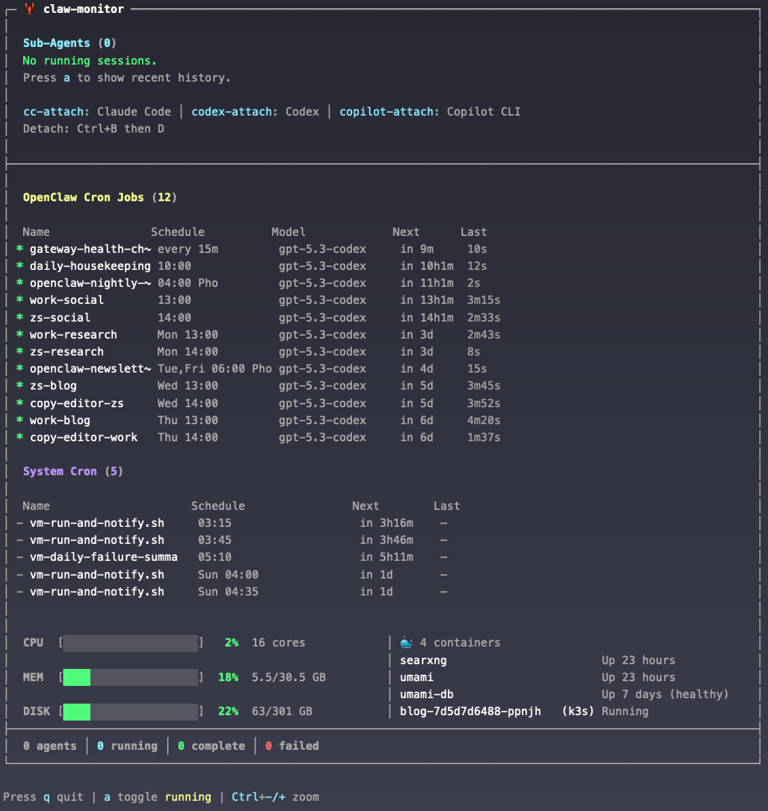
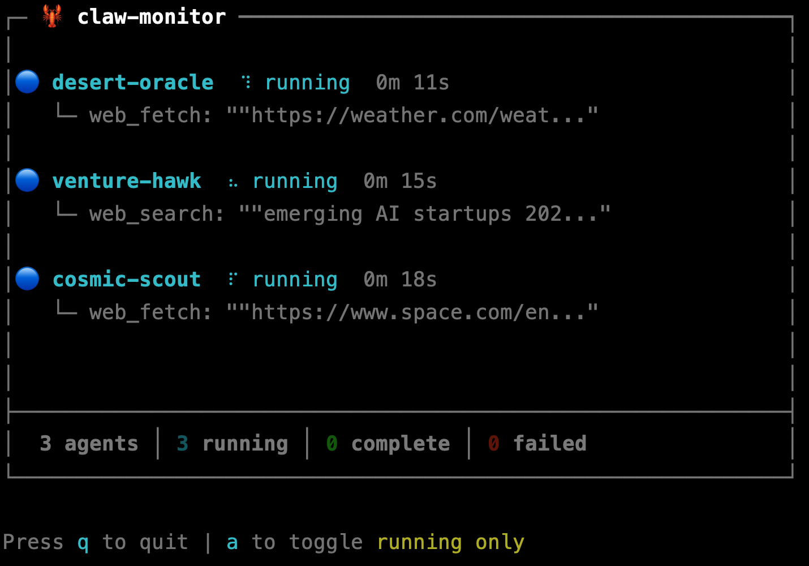

# 🦞 claw-monitor


A terminal dashboard for monitoring [OpenClaw](https://github.com/openclaw/openclaw) agents, cron jobs, Docker containers, and system resources in real-time on Linux/WSL or MacOS.



## Features

### Sub-Agent Monitoring
- **Live session tracking** — Watch sub-agents work in real-time with status updates
- **Session labels** — Shows spawn labels for easy identification
- **Tool activity** — Displays the current tool being executed and total tool calls
- **Elapsed time** — Track how long each session has been running
- **Agent detail view** — Select agents with arrow keys and press Enter to expand (recent tools, errors, full label)
- **Toggle modes** — Switch between "running only" and "all recent" views (`a` key)

### Coding Agent Detection
- **Process monitoring** — Detects running Claude Code, Copilot CLI, and Codex processes
- **Attach commands** — Jump into any coding agent's interactive tmux session
- **PID and runtime** — See process IDs and cumulative CPU time

### Cron Job Dashboard
- **OpenClaw cron jobs** — Lists every job with name, schedule, model, next run, and last duration
- **System cron jobs** — Shows root crontab entries with schedule, next run, and last run
- **Human-readable schedules** — Translates cron expressions to readable format (`Mon 13:00`, `every 15m`, `Tue,Fri 06:00`)
- **Relative next-run times** — Shows when each job fires next (`in 8m`, `in 4d`)
- **Error tracking** — Highlights failing jobs with consecutive error counts
- **Running indicator** — Shows which jobs are actively executing
- **Sorted by next run** — Soonest jobs appear first

### System Resources & Docker
- **CPU / Memory / Disk** — Color-coded bar charts with usage percentages and details
- **GPU monitoring** — NVIDIA GPU usage via `nvidia-smi` (auto-detected)
- **Docker containers** — Shows running container names and status
- **Kubernetes pods** — Shows k8s/k3s pods (auto-detected, system namespaces filtered)
- **Two-column layout** — Resource gauges on the left, containers/pods on the right
- **Color thresholds** — Green (healthy), yellow (≥70%), red (≥90%) — configurable via env vars

### Responsive Layout
- **Auto-sizing** — Dashboard width adapts to your terminal (60–120 columns)
- **Resize handling** — Responds to terminal resize events in real-time





## Install

```bash
git clone https://github.com/DanWahlin/claw-monitor.git
cd claw-monitor
npm install
npm run build
```

## Usage

```bash
./bin/claw-monitor.js
```

Or add to your PATH for global access (run from the project root):

```bash
npm link
```

Then run from anywhere:

```bash
claw-monitor
```

### Controls

| Key | Action |
|-----|--------|
| `q` or `Ctrl+C` | Quit |
| `a` | Toggle between running-only and all sessions |
| `↑` `↓` | Select agent (when agents are running) |
| `Enter` | Expand/collapse agent details |
| `Cmd+-/+` or `Ctrl+-/+` | Zoom terminal font size |

## Coding Agent Attach Commands

claw-monitor detects running coding agents (Claude Code, Copilot CLI, Codex) via process monitoring. To jump into an agent's interactive terminal session, use the attach commands included in `bin/`:

### Setup

```bash
# Symlink to PATH (one-time)
sudo ln -sf "$(pwd)/bin/cc-attach" /usr/local/bin/cc-attach
sudo ln -sf "$(pwd)/bin/copilot-attach" /usr/local/bin/copilot-attach
sudo ln -sf "$(pwd)/bin/codex-attach" /usr/local/bin/codex-attach
```

### Commands

| Command | Attaches to |
|---------|------------|
| `cc-attach` | Claude Code |
| `copilot-attach` | Copilot CLI |
| `codex-attach` | Codex |

Detach from any session with `Ctrl+B` then `D` — the agent keeps running in the background.

> **Note:** These commands attach to tmux sessions named `cc`, `ghcp`, and `codex`. The sessions are created by your OpenClaw agent when it launches coding tasks. If no session is running, you'll see a message telling you to start one.

## Configuration

All settings can be overridden with environment variables:

| Variable | Default | Description |
|----------|---------|-------------|
| `OPENCLAW_DIR` | `~/.openclaw/agents/main/sessions` | Path to OpenClaw sessions directory |
| `POLL_AGENTS` | `500` | Sub-agent poll interval (ms) |
| `POLL_CODING` | `5000` | Coding agent poll interval (ms) |
| `POLL_STATS` | `10000` | System stats poll interval (ms) |
| `POLL_CRON` | `15000` | OpenClaw cron poll interval (ms) |
| `POLL_SYSCRON` | `60000` | System cron poll interval (ms) |
| `MAX_SESSIONS` | `10` | Maximum sessions to display |
| `WARN_THRESHOLD` | `70` | Yellow threshold for resource bars (%) |
| `CRIT_THRESHOLD` | `90` | Red threshold for resource bars (%) |
| `BAR_WIDTH` | `20` | Width of resource bar charts |

Example:

```bash
POLL_STATS=5000 WARN_THRESHOLD=60 claw-monitor
```

## Requirements

- Node.js 18+
- OpenClaw installed and running
- tmux (for coding agent attach/detach)

Optional (auto-detected):
- `nvidia-smi` — for GPU monitoring
- Docker — for container monitoring
- `kubectl` — for Kubernetes/k3s pod monitoring

## How It Works

### Sub-Agents
Watches OpenClaw's session directory (`~/.openclaw/agents/main/sessions/`) and `sessions.json` metadata to identify sub-agent sessions, parse JSONL logs for tool usage, and track activity via `updatedAt` timestamps.

### Coding Agents
Polls `ps aux` to detect running coding agent processes:

| Agent | Process pattern | Icon |
|-------|----------------|------|
| Claude Code | `claude --dangerously` | 🤖 |
| Copilot CLI | `gh copilot` | 🐙 |
| Codex | `codex` | 📦 |

Filters out wrapper processes (sudo, bash, node shims) and deduplicates to one entry per agent type.

### Cron Jobs
- **OpenClaw** — Runs `openclaw cron list --json` to fetch scheduled jobs
- **System** — Parses `crontab -l` for root crontab entries

Both parse cron expressions into human-readable schedules, calculate relative next-run times, and handle day-of-month / day-of-week OR logic per the cron spec.

### System Stats
- **CPU** — Parsed from `top` output
- **Memory** — `os.totalmem()` / `os.freemem()`
- **Disk** — Parsed from `df -BG /`
- **GPU** — Parsed from `nvidia-smi --query-gpu` (when available)
- **Docker** — Parsed from `docker ps --format` (when available)
- **Kubernetes** — Parsed from `kubectl get pods` (when available); auto-detects k3s via `/etc/rancher/k3s/k3s.yaml`

## Built With

- [Ink](https://github.com/vadimdemedes/ink) — React for CLI apps
- [tmux](https://github.com/tmux/tmux) — Terminal multiplexing for coding agent sessions

## License

MIT © Dan Wahlin
